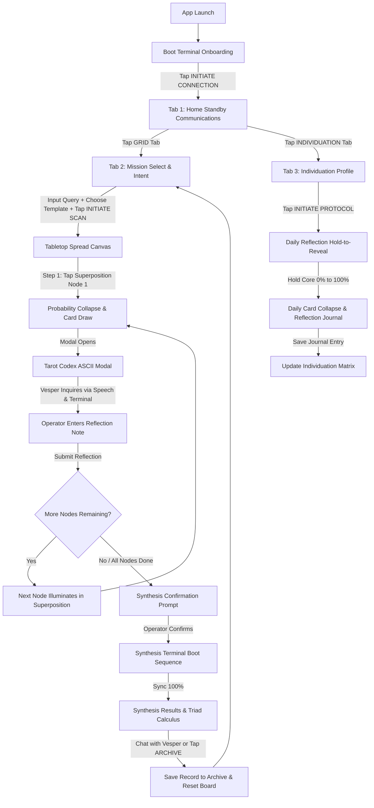

# 02 // FLOW & STATE MACHINE SPECIFICATION
## Comprehensive UX Architecture, Screen Transitions & Sequences

---

## 1. Application Master Flow Diagram



---

## 2. Phase 1: Boot Terminal & Onboarding (`BootConsoleView`)

**Screenshot Reference:** `screenshots/01_boot_onboarding.png`

```
╔═════════════════════════════════════════╗
║  .-----------------------------------.  ║
║  |            V E S P E R            |  ║
║  |                                   |  ║
║  |  > FATAL ERROR: KERNEL PANIC      |  ║
║  |  > OVERRIDE BY: VESPER            |  ║
║  |  ===============================  |  ║
║  |      SYS.NAME: VESPER             |  ║
║  |      SYS.VER:  v9.0.0             |  ║
║  |      SYS.PURP: SHADOW TAROT ENGINE|  ║
║  |  ===============================  |  ║
║  |  > UPLINK ESTABLISHED.            |  ║
║  |                                   |  ║
║  |    +-------------------------+    |  ║
║  |    | [ INITIATE CONNECTION ] |    |  ║
║  |    +-------------------------+    |  ║
║  '-----------------------------------'  ║
╚═════════════════════════════════════════╝
```

### State Logic & Behavior
1. App launches with an authentic CRT terminal boot frame surrounded by a matrix glyph border.
2. Displays the system takeover narrative: `> FATAL ERROR: KERNEL PANIC`, `> OVERRIDE BY: VESPER`.
3. System parameters: `SYS.NAME: VESPER`, `SYS.VER: v9.0.0`, `SYS.PURP: SHADOW TAROT ENGINE`.
4. When the user taps `[ INITIATE CONNECTION ]`, play dial-up connection handshake audio, trigger medium haptic feedback, and set `isOnboarded = true` (persisted in `@AppStorage`).
5. Seamlessly transition to **Home Standby View** via Framer Motion / SwiftUI `.transition(.opacity.combined(with: .scale(scale: 1.02)))`.

---

## 3. Phase 2: Home Standby Communications (`HomeView`)

**Screenshot Reference:** `screenshots/02_home_chat_view.png`

### Visual Structure
- **Top Sensor Ticker:** Continuous marquee streaming real-world telemetry (`COORD: 43.27, -79.78`, `KP-INDEX: 2.1`, `POWER: 100%`, `TEMP: 21.5°C`).
- **Header Banner:** `> COMMUNICATION LINK` with `[ BIOS v9.0.2 ]`, Audio Mute/Unmute button with equalizer level bars, Affect `[NEUTRAL]`, Uplink `[ONLINE]`.
- **Center Canvas:** 3D Rotating Egrego-Pet Sacred Geometry polytope reacting to audio frequencies.
- **Bottom 30% Terminal Card:** 
  - Monospace log containing timestamped dialogue.
  - Typewriter ScrambleText for incoming Vesper transmissions.
  - Single-line prompt input (`>_ Enter message...`) with Send button and Voice Dictation mic button.

---

## 4. Phase 3: Mission Select & Intent Configuration (`TabletopView` Standby)

**Screenshot Reference:** `screenshots/03_grid_mission_select.png`

When the user taps the **GRID** tab, if no reading is currently active, the interface renders **MISSION SELECT**:

### UI Components & Requirements
1. **Section Header:** `> MISSION SELECT` `[ BIOS v9.0.2 ]` with status tag `STAT [STANDBY]`.
2. **Intent Query Input (REQUIRED):**
   - Header: `> INTENT QUERY [ REQUIRED ]`
   - Monospace text input with amber highlight: `>_ Enter your topic of inquiry`.
   - **Crucial Rule:** The `[ INITIATE SCAN ]` button is **DISABLED** until the Operator types at least 3 characters into this field.
3. **Initialization Templates:**
   - **Quick Inquiry (3 Nodes):** `[ RECOMMENDED FOR FIRST DEPLOYMENT ]` -> `1. Current Vector` -> `2. System Restraint` -> `3. Action on Objective`.
   - **Challenge Resolution (5 Nodes):** `1. Threat Assessment` -> `2. Hidden Variables` -> `3. Route Clearance` -> `4. External Support` -> `5. Resolution`.
   - **Full System Scan (10 Nodes):** Macro-System Tree of Life mapping across the 10 Sephirot.
4. **Deploy Button:** Sticky bottom button `[ INITIATE SCAN ]`. Tapping triggers heavy haptics, initializes the spread in the Board Store, and transitions to the 3D Spread Canvas.

---

## 5. Phase 4: Guided Tabletop Spread Canvas (`SpreadCanvasView`)

**Screenshot Reference:** `screenshots/04_tabletop_spread_active.png` & `screenshots/05_tabletop_node_focus_modal.png`

### Step-by-Step Guided Sequence Machine

```
[ Spread Initialized ]
        │
        ▼
[ Node 1 Illuminates in SUPERPOSITION ]
  • Coordinates tagged (Lat/Long/Kp)
  • Matrix glyphs scramble
  • Terminal prompts: "Tap the illuminated node to collapse the probability matrix..."
        │
        ▼
[ Operator Taps Node 1 ]
  • Heavy Haptic Shockwave
  • Probability Collapses -> Random Tarot Card Drawn
  • Card flips from glowing wireframe to revealed state
        │
        ▼
[ Codex ASCII Modal Opens ]
  • Full ASCII Card Frame with Jungian Directive
  • Vesper synthesizes personalized inquiry question via Gemini in real time
  • Vesper speaks question aloud in elder British voice (`en-GB`)
  • Bottom Terminal input is activated
        │
        ▼
[ Operator Enters Reflection ]
  • Operator types their reflection / insight into bottom Terminal
  • Operator presses Send
  • Reflection is pinned to Node 1's memory
  • Codex modal dismisses
        │
        ▼
[ Node 2 Illuminates in SUPERPOSITION ]
  • Sequence repeats for all remaining nodes
```

### The "Black Ice" Hostile Archetype Exception
If any of the 6 hostile shadow archetypes are drawn:
`["DEATH", "THE DEVIL", "THE TOWER", "TEN OF SWORDS", "NINE OF SWORDS", "THREE OF SWORDS"]`

1. The Codex modal border flashes red with chromatic aberration jitter.
2. Displays: `! BLACK ICE DETECTED: HOSTILE ARCHETYPE ! Cognitive safety protocols forbid autonomous engagement with Shadow elements.`
3. The `[ EXEC ]` button is locked and replaced with a text input requiring the Operator to type **`OVERRIDE`** in capital letters before proceeding.

---

## 6. Phase 5: Post-Mission Synthesis & Compilation (`SynthesisTerminal`)

Once the final node's reflection has been submitted:

1. **Synthesis Prompt:** Vesper's terminal outputs:
   > *"Probability matrix is fully stabilized. All nodes have collapsed from superposition. Are you ready to compile the full synthesis report?"*
2. **Operator Confirms:** Tapping `[ ENGAGE SYNTHESIS ]` boots the fullscreen **Synthesis Terminal**.
3. **Boot Calibration:** Displays rapid scrolling matrix logs (`[ CALIBRATING TRIAD VECTORS ]`, `[ MERGING ENVIRONMENTAL TELEMETRY ]`, `[ EVALUATING ELEMENTAL DIGNITIES ]`) with a 0% -> 100% progress sync bar.
4. **Results Terminal:**
   - **Executive Synthesis Report:** Generated by Gemini incorporating drawn cards, user reflection notes, and environmental telemetry modifiers.
   - **Elemental Dignities Matrix:** Triad pairings (e.g. Fire + Air = Additive Synthesis; Water + Fire = Ill-Dignified Contradiction).
   - **Interactive Reading Debrief:** Operator can converse continuously with Vesper about the reading.
   - **`[ ARCHIVE REPORT ]` Button:** Saves the session into SwiftData / persistent store and resets the tabletop grid.

---

## 7. Phase 6: Individuation Profile & Daily Reflection (`ProfileArchiveView`)

**Screenshot Reference:** `screenshots/06_profile_archive_view.png` & `screenshots/07_daily_reflection_modal.png`

### Individuation Matrix
Tracks the Operator's psychological integration across 4 core variables:
- **`PERSONA` (White/Gray):** Structural mask presented to interfaces.
- **`SHADOW` (Magi Violet):** Repressed occult potential and uncataloged vectors.
- **`ANIMA` (Magi Orange):** Intuitive feeling and analog emotional channel.
- **`SELF` (Eva Cyan):** Integrated whole unifying all three.

### The "Hold-to-Reveal" Daily Reflection Protocol
1. User taps `[ INITIATE PROTOCOL ]` on the Individuation tab.
2. The Daily Reflection modal opens showing a central pulsating Core Node: `HOLD CORE TO REVEAL`.
3. **Charging Phase:** User presses and holds down on the core node:
   - `0% -> 49%`: Core glows with intensifying violet aura and haptic vibration ticks.
   - `50%`: Behind the scenes, the app pre-fetches the Tarot draw and fires the Gemini prompt query in parallel to eliminate latency.
   - `100%`: Field collapses with a heavy haptic pulse. The drawn card reveals in ASCII art with Vesper's daily inquiry prompt.
4. User logs their daily reflection note and taps Save -> Updates the Individuation Matrix percentages!
