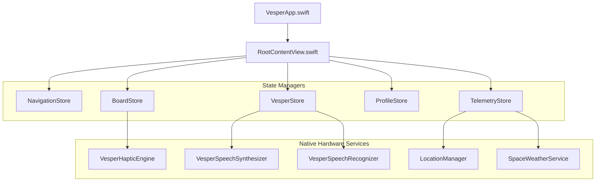

# 05 // SWIFTUI NATIVE IMPLEMENTATION ARCHITECTURE
## Native iOS 17+ Swift 6 / SwiftUI Code Blueprints & Hardware Engines

---

## 1. App Architecture & State Store Graph



---

## 2. Audio & Neural Speech Engine (`VesperSpeechSynthesizer.swift`)

Vesper's voice MUST be rendered in native iOS using the high-clarity **British Elder (`en-GB`)** neural voice profile:

```swift
import AVFoundation
import SwiftUI

public class VesperSpeechSynthesizer: NSObject, ObservableObject, AVSpeechSynthesizerDelegate {
    public static let shared = VesperSpeechSynthesizer()
    
    private let synthesizer = AVSpeechSynthesizer()
    @Published public var isSpeaking: Bool = false
    @Published public var audioLevel: Float = 0.0
    
    private var levelTimer: Timer?
    
    override private init() {
        super.init()
        synthesizer.delegate = self
        configureAudioSession()
    }
    
    private func configureAudioSession() {
        do {
            let session = AVAudioSession.sharedInstance()
            try session.setCategory(.playback, mode: .voicePrompt, options: [.duckOthers])
            try session.setActive(true)
        } catch {
            print("Failed to configure audio session: \(error)")
        }
    }
    
    public func speak(_ text: String, completion: (() -> Void)? = nil) {
        synthesizer.stopSpeaking(at: .immediate)
        
        let utterance = AVSpeechUtterance(string: text)
        
        // Select British English voice (Daniel / Oliver / Arthur / George)
        if let britishVoice = AVSpeechSynthesisVoice(language: "en-GB") {
            utterance.voice = britishVoice
        }
        
        utterance.rate = 0.48           // Measured, tactical cadence
        utterance.pitchMultiplier = 0.88 // Deep, architectural resonance
        utterance.preUtteranceDelay = 0.05
        utterance.postUtteranceDelay = 0.1
        
        startAudioMetering()
        synthesizer.speak(utterance)
    }
    
    public func stop() {
        synthesizer.stopSpeaking(at: .immediate)
        stopAudioMetering()
        isSpeaking = false
    }
    
    private func startAudioMetering() {
        isSpeaking = true
        levelTimer?.invalidate()
        levelTimer = Timer.scheduledTimer(withTimeInterval: 0.05, repeats: true) { [weak self] _ in
            guard let self = self else { return }
            if self.isSpeaking {
                self.audioLevel = Float.random(in: 0.25...0.95)
            } else {
                self.audioLevel = 0.0
            }
        }
    }
    
    private func stopAudioMetering() {
        levelTimer?.invalidate()
        levelTimer = nil
        audioLevel = 0.0
        isSpeaking = false
    }
    
    public func speechSynthesizer(_ synthesizer: AVSpeechSynthesizer, didFinish utterance: AVSpeechUtterance) {
        stopAudioMetering()
    }
}
```

---

## 3. CoreHaptics Tactical Engine (`VesperHapticEngine.swift`)

```swift
import CoreHaptics
import UIKit

public class VesperHapticEngine {
    public static let shared = VesperHapticEngine()
    private var engine: CHHapticEngine?
    
    private init() {
        createEngine()
    }
    
    private func createEngine() {
        guard CHHapticEngine.capabilitiesForHardware().supportsHaptics else { return }
        do {
            engine = try CHHapticEngine()
            try engine?.start()
        } catch {
            print("CoreHaptics creation failed: \(error)")
        }
    }
    
    // 1. Probability Collapse (Card Draw)
    public func playCollapseHaptic() {
        let generator = UIImpactFeedbackGenerator(style: .heavy)
        generator.prepare()
        generator.impactOccurred(intensity: 1.0)
    }
    
    // 2. Terminal Click / Send Message
    public func playTacticalClick() {
        let generator = UIImpactFeedbackGenerator(style: .rigid)
        generator.prepare()
        generator.impactOccurred(intensity: 0.8)
    }
    
    // 3. Black Ice Hostile Warning
    public func playBlackIceWarning() {
        let notification = UINotificationFeedbackGenerator()
        notification.prepare()
        notification.notificationOccurred(.warning)
    }
    
    // 4. Hold-to-Reveal Continuous Charge
    public func playChargeTick(progress: Double) {
        let intensity = Float(min(max(progress, 0.1), 1.0))
        let generator = UIImpactFeedbackGenerator(style: intensity > 0.7 ? .heavy : .medium)
        generator.prepare()
        generator.impactOccurred(intensity: CGFloat(intensity))
    }
}
```

---

## 4. Root View Hierarchy (`RootContentView.swift`)

```swift
import SwiftUI

public struct RootContentView: View {
    @StateObject private var nav = NavigationStore.shared
    @StateObject private var vesper = VesperStore.shared
    @StateObject private var board = BoardStore.shared
    @StateObject private var profile = ProfileStore.shared
    @StateObject private var telemetry = TelemetryStore.shared
    
    @AppStorage("vesper_is_onboarded") private var isOnboarded: Bool = false
    
    public init() {}
    
    public var body: some View {
        ZStack {
            // Absolute Void Black Background
            Color.voidBlack.ignoresSafeArea()
            
            if !isOnboarded {
                BootConsoleView(onConnect: {
                    withAnimation(.easeInOut(duration: 0.6)) {
                        isOnboarded = true
                    }
                })
            } else {
                VStack(spacing: 0) {
                    // Top Real-World Telemetry Ticker
                    VesperTelemetryRowView()
                    
                    // Main Viewport Switching
                    Group {
                        switch nav.activeTab {
                        case .home:
                            HomeView()
                        case .tabletop:
                            TabletopView()
                        case .individuation:
                            ProfileArchiveView()
                        }
                    }
                    .frame(maxWidth: .infinity, maxHeight: .infinity)
                    
                    // Sticky Bottom Thumb-Zone Tab Bar
                    TabBarView()
                }
                
                // Fullscreen Synthesis Results Overlay
                if board.isSynthesisActive {
                    SynthesisTerminalView()
                        .transition(.move(edge: .bottom).combined(with: .opacity))
                        .zIndex(2000)
                }
            }
            
            // Global CRT Scanline Artifact Overlay
            CRTScanlineOverlay()
        }
        .environmentObject(nav)
        .environmentObject(vesper)
        .environmentObject(board)
        .environmentObject(profile)
        .environmentObject(telemetry)
    }
}
```

---

## 5. Implementation Quality Checklist for Mac Agent

Before deploying or finalizing the iOS build, verify each requirement:

- [ ] **Background Color:** Every screen root is pure `Color.black` (`#000000`). No gray cards.
- [ ] **Typography:** Every label uses `.monospaced()` or `SF Mono`. Zero proportional sans-serif.
- [ ] **CRT Scanlines:** `CRTScanlineOverlay` is rendered over the entire app at 15% opacity.
- [ ] **Glyph Scramble:** Section headers and card names execute `ScrambleTextView` on appearance.
- [ ] **3D Thoughtform:** Central viewport renders the rotating wireframe sacred geometry.
- [ ] **Thumb-Zone Terminal:** Terminal prompt input bar is permanently anchored in the bottom 30% of the screen.
- [ ] **Mission Select:** Intent Query field is required before `[ INITIATE SCAN ]` unlocks.
- [ ] **Probability Superposition:** Undrawn nodes show `[ SUPERPOSITION ]` with live coordinate stamps.
- [ ] **Codex ASCII Modal:** Drawn cards render inside 32-character framed ASCII boxes.
- [ ] **Elder British Voice:** `AVSpeechSynthesisVoice(language: "en-GB")` with pitch `0.88` and rate `0.48`.
- [ ] **Zero Servitude:** Vesper never says "How can I help you?". He speaks as an authoritative peer.
- [ ] **Black Ice Override:** Hostile archetypes flash red and require typing "OVERRIDE".
- [ ] **Hold-to-Reveal:** Daily Reflection charges from 0% to 100% with haptic escalation before drawing.
- [ ] **Synthesis Reports:** Complete spreads compile into Triad Elemental Dignities and archive cleanly.
