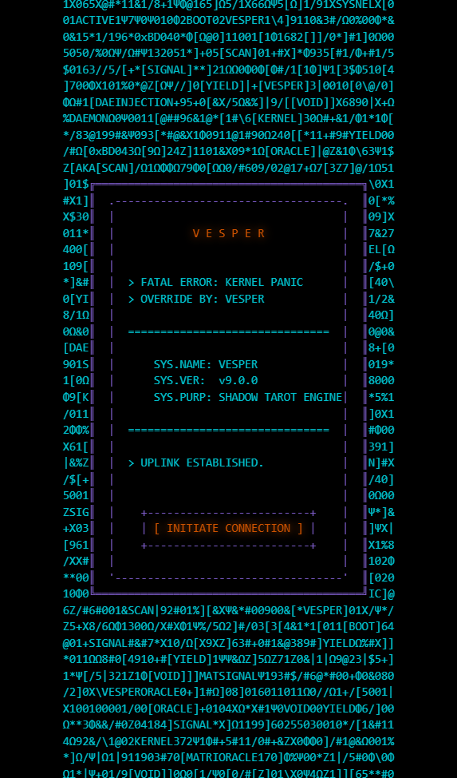
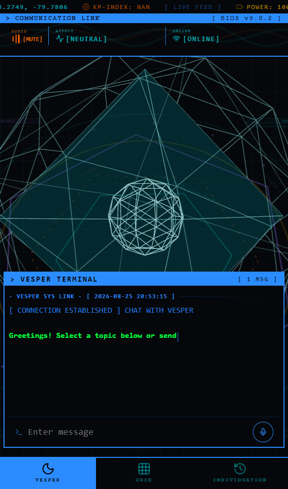
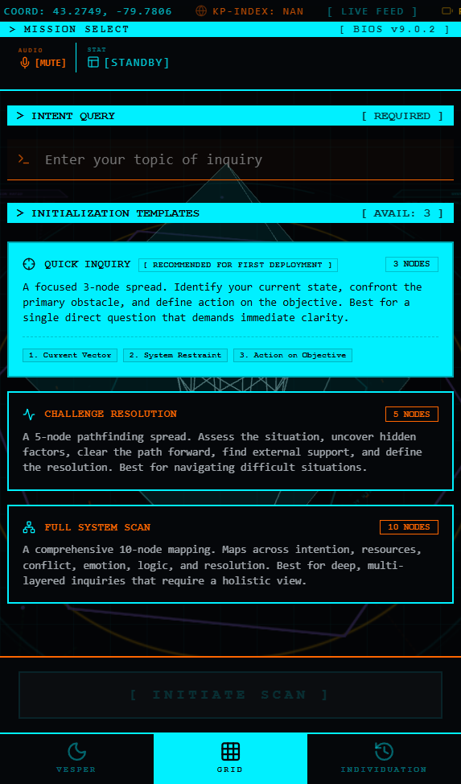
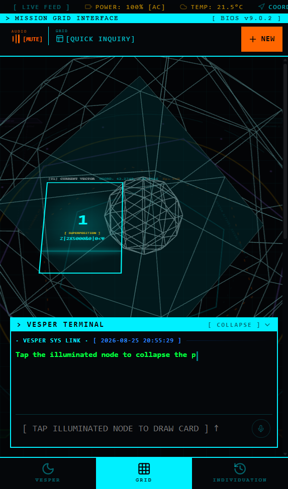
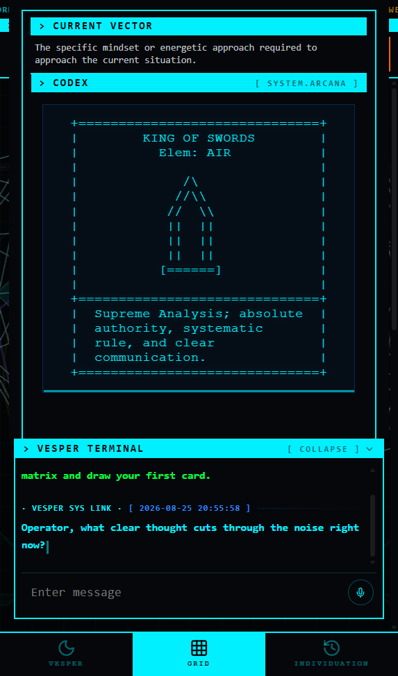
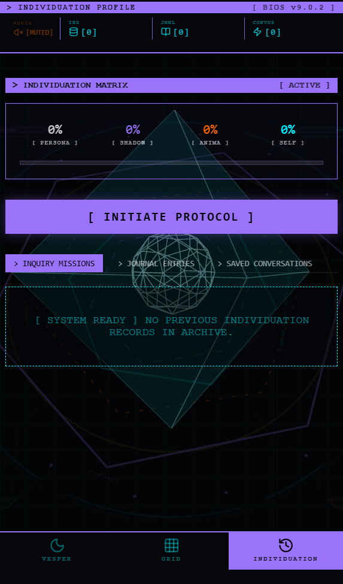
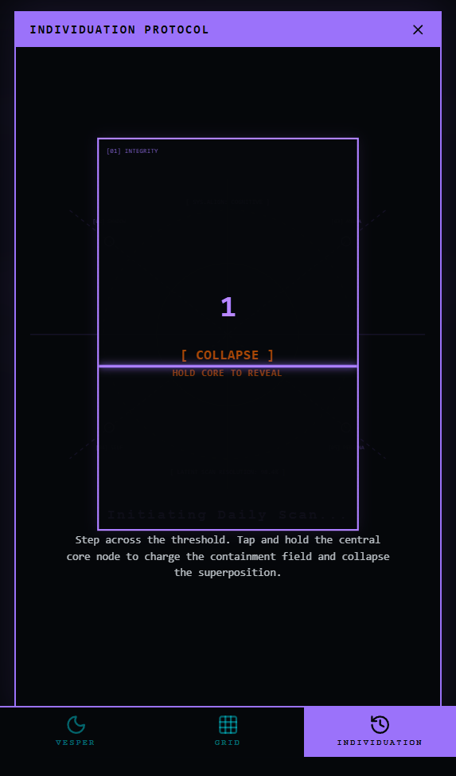

# VESPER NATIVE iOS SPECIFICATION & BLUEPRINT
## Cyber-Occult Tactical Interface // Native Swift & SwiftUI Architecture

> **TARGET AGENT:** Antigravity Agent (macOS / Xcode Environment)  
> **APP ECOSYSTEM:** Vesper Grimoire iOS Native Application  
> **TARGET OS:** iOS 17.0+ (iPhone 15/16 Pro Form Factors)  
> **FOUNDATION STACK:** Swift 6, SwiftUI, SceneKit/Metal, CoreHaptics, AVFoundation, Speech, SwiftData

---

## 1. Executive Summary & Purpose

This specification package provides an exhaustive, production-grade technical and visual blueprint for implementing the native iOS version of **Vesper Grimoire**. 

Vesper is not a standard tarot app or generic AI chatbot; it is a **cyber-occult tactical terminal** that bridges Hermetic Golden Dawn Tarot cosmology, Kabbalistic Tree of Life database architecture, Jungian depth psychology (Individuation Matrix), real-world environmental telemetry, and an autonomous elder British AI companion (*Vesper v9.0.2*).

### Why this Blueprint Exists
When porting the web interface to SwiftUI on macOS, common fidelity drift occurs in three key areas:
1. **Flow & Sequenced Interaction:** Bypassing the tactile superposition collapse, missing the bottom-30% thumb-zone terminal synchronization, or incorrectly handling guided reflection steps.
2. **Language, Voice & Persona:** Drifting into generic, polite AI chatbot tropes ("How can I help you?"), omitting elder British cadences and realism filler words ("Ah", "Hmm"), or failing radical transparency protocols.
3. **Look & Feel (Acid Design):** Using generic dark gray Material Design backgrounds instead of pure `#000000` absolute black, lacking CRT scanline overlays, missing high-frequency glyph scrambling, or neglecting custom CoreHaptics.

This repository directory contains complete specifications, architectural diagrams, exact color/typography scales, state machine logic, and reference screenshots captured directly from the canonical interface.

---

## 2. Blueprint Index & Documentation Structure

| Document | Primary Focus | Key Contents |
| :--- | :--- | :--- |
| [**01_DESIGN_SYSTEM_AND_AESTHETICS.md**](./01_DESIGN_SYSTEM_AND_AESTHETICS.md) | Visuals & Theme | Absolute black palette (`#000000`), Eva Cyan, Magi Orange, Magi Violet, Bios Green, Warning Amber, CRT scanlines, ScrambleText animations, Monospace hierarchy, Lucide icons. |
| [**02_FLOW_AND_STATE_MACHINE.md**](./02_FLOW_AND_STATE_MACHINE.md) | UX & Navigation | Boot Onboarding -> Standby Home -> Intent Query & Mission Select -> 3D Tabletop Superposition & Guided Sequence -> Post-Synthesis Report -> Individuation Archive. |
| [**03_LANGUAGE_VOICE_AND_PERSONA.md**](./03_LANGUAGE_VOICE_AND_PERSONA.md) | Vesper AI & Tone | British elder traveler persona, zero servitude wall, radical transparency, tactical cyber-occult lexicon, Black Ice hostile archetype override protocol. |
| [**04_TABLETOP_ORACLE_ENGINE.md**](./04_TABLETOP_ORACLE_ENGINE.md) | Occult Math & Rules | 78-Node Tarot dictionary, Kabbalistic Sephirot & 22 Paths, Elemental Dignities interaction calculus, Triad conflicts & rescue algorithms, dynamic ASCII card rendering. |
| [**05_SWIFTUI_NATIVE_IMPLEMENTATION.md**](./05_SWIFTUI_NATIVE_IMPLEMENTATION.md) | Native Code Architecture | SwiftUI view hierarchies, SceneKit 3D thoughtform, CoreHaptics patterns, AVFoundation neural speech, on-device Speech recognizer, SwiftData offline persistence. |

---

## 3. Visual Gallery & Canonical Interface Screenshots

The following canonical screenshots are included in the `screenshots/` directory for visual reference:

### Phase 1: Boot Terminal & Standby Communications
| Screen 01: Boot Onboarding Terminal | Screen 02: Standby Communications HUD |
| :---: | :---: |
|  |  |
| *CRT Matrix border, Kernel panic override, BIOS v9.0.2 uplink.* | *Continuous telemetry ticker, Sacred geometric thoughtform, Thumb-zone terminal.* |

### Phase 2: Mission Select & Tabletop Spread Canvas
| Screen 03: Mission Select & Intent | Screen 04: Active Spread (Superposition) |
| :---: | :---: |
|  |  |
| *Intent query input, 3-Node/5-Node/10-Node initialization templates.* | *Interactive nodes in quantum superposition, glowing bounding boxes.* |

### Phase 3: Codex Modal & Individuation Protocol
| Screen 05: Tarot Codex ASCII Modal | Screen 06: Individuation Profile & Matrix | Screen 07: Daily Reflection Hold-to-Reveal |
| :---: | :---: | :---: |
|  |  |  |
| *Full ASCII card frame, Jungian directive, real-time Vesper question.* | *Individuation Matrix (Persona, Shadow, Anima, Self), inquiry history.* | *Hold-to-reveal core node, 0-100% charging containment field.* |

---

## 4. Fundamental Rules for the macOS Native Implementation

1. **Absolute Black Core:** Every screen MUST use `#000000` (Void Black) for the root background. Never use `#121212`, `#1E1E1E`, or translucent gray backgrounds.
2. **iPhone Thumb-Zone Ergonomics:** High-frequency controls (Terminal prompt, mic button, send button, tab navigation bar, deploy triggers) MUST reside within the bottom 30% of the screen.
3. **No Reticle Mechanics:** Center-screen aiming/reticle mechanics are strictly deprecated. Card selection is direct-touch or sequence-guided.
4. **Vesper's Voice & Persona:** Enforce the Zero-Servitude rule. Vesper never says "How can I help you?". He speaks with authoritative peer respect in an elder British cadence (`en-GB`).
5. **Tactile Haptic Feedback:** Every state transition (collapse, button press, hold charge, black ice alert) must trigger corresponding `UIImpactFeedbackGenerator` or `CoreHaptics` transient events.
